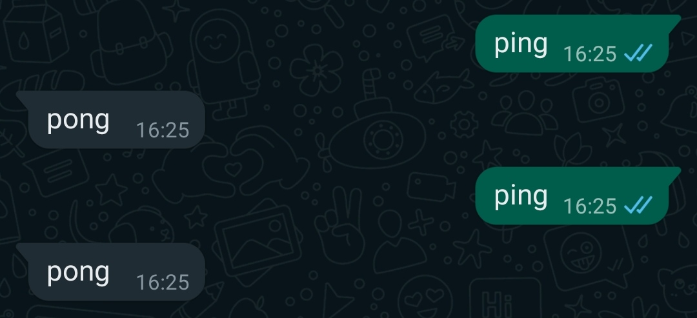

<h1 align="center"><a href="https://paguiar.link/whatsmeow-quickstart">WhatsMeow® Quickstart</a></h1>

<p align="center">
    <br>
  <a href="https://pixabay.com/vectors/run-sport-stand-success-ready-2872201/">
    
  </a>
  <br><br>
  Discover the power of WhatsMeow® with a just a few clicks
  <br>
</p>

<br>

## QuickStart with Docker (Recommended)

```sh
docker run paguiar735/whatsmeow-quickstart
```

## Manual QuickStart

> **Note**: You'll need the latest version of Go installed on your system.

1. Clone the repository and cd into it:

```
git clone https://github.com/codespearhead/whatsmeow-quickstart
cd whatsmeow-quickstart
```

2.  Download the dependencies used in the minimal working example

```
go mod download
```

3.  Run the minimal working example:

```
go run main.go
```

## Usage

After scanning the QRCode, send "ping" (without quotes) to the WhatsApp account logged into the program. It'll send "pong" back.

<p align="center">
  <br>
    
  <br><br>
</p>

## Disclaimers

> **Warning**: Your antivirus software might mark the project as dangerous at runtime. [It's a false positive](https://go.dev/doc/faq#virus).

> **Warning**: WhatsApp's averse to any type of automation that it considers to be "Harm[ful] to WhatsApp or [their] Users" on its platform, unless it's coming from an official WhatsApp Businesses API partner. So, it’s advisable to read WhatsApp's [Terms of Service](https://www.whatsapp.com/legal/terms-of-service) in order not to break them. Use this software at your own risk.

> **Warning**: Do not log out immediately after logging in (scanning the QRCode), otherwise various panic messages will be raised because [WhatsMeow will unlikely be done with the logging in process by then](https://github.com/tulir/whatsmeow/issues/295). If you want to log out, wait a few seconds and only then press CTRL+C.

> **Note**: This repository was built upon the currently official [quickstart](https://godocs.io/go.mau.fi/whatsmeow#example-package) of WhatsMeow®.

> **Note**: We are not affiliated, associated, authorized, endorsed by or in any way officially connected to WhatsApp, LLC. ([www.whatsapp.com](https://www.whatsapp.com)).

> **Note**: We are not affiliated, associated, authorized, endorsed by or in any way officially connected to WhatsMeow®. ([go.mau.fi/whatsmeow](https://go.mau.fi/whatsmeow)).

> **Note**:
> Copyright Disclaimer under section 107 of the Copyright Act 1976, allowance is made for “fair use” for purposes such as criticism, comment, news reporting, teaching, scholarship, education and research.
> Fair use is a use permitted by copyright statute that might otherwise be infringing.
> Non-profit, educational or personal use tips the balance in favor of fair use.
